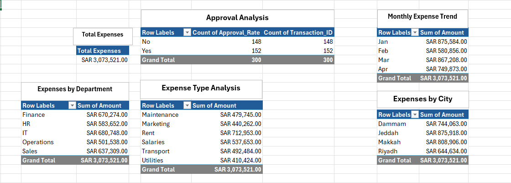
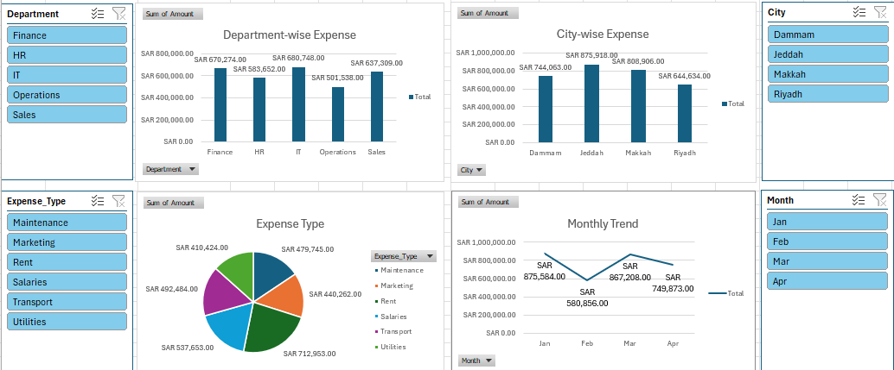

# 📊 KSA Financial Expense Analysis Dashboard (Excel)
### 🎓 Personal Project

---

## 📑 Table of Contents
- [Overview](#overview)
- [Business Problem](#business-problem)
- [Stakeholders](#stakeholders)
- [Dataset Description](#dataset-description)
- [Tools & Technologies Used](#tools--technologies-used)
- [Skills Demonstrated](#skills-demonstrated)
- [Key Metrics / KPIs](#key-metrics--kpis)
- [Project Workflow](#project-workflow)
- [Results](#results)
- [Key Insights & Business Recommendations](#key-insights--business-recommendations)
- [Challenges & Solutions](#challenges--solutions)
- [Project Learnings](#project-learnings)

---

## 📌 Overview
This project presents an end-to-end **financial expense analysis solution** built in Microsoft Excel, focused on a business operating in Saudi Arabia.  
It covers data cleaning, transformation, analysis using pivot tables, and an interactive dashboard to support financial decision-making.

---

## 💼 Business Problem
The company lacks visibility into:
- Department-wise spending  
- City-wise operational costs  
- Expense category distribution  
- Approval status of financial transactions  

This leads to inefficient budgeting, poor financial control, and difficulty identifying cost-saving opportunities.

---

## 👥 Stakeholders
- Finance Department  
- Operations Team  
- Management / Executives  
- Accounts Team  

---

## 📊 Dataset Description
The dataset contains **300 financial transactions** with the following fields:

- Transaction_ID  
- Transaction_Date  
- Department  
- City  
- Expense_Type  
- Amount_SAR  
- Payment_Method  
- Approved_Status  

Additional derived columns:
- Month  
- Approval_Numeric (1 = Yes, 0 = No)  
- Expense_Category (Fixed / Variable)  

---

## 🛠 Tools & Technologies Used
- Microsoft Excel  
- Pivot Tables  
- Pivot Charts  
- Slicers  
- Excel Formulas  
- Data Cleaning Techniques  

---

## 🚀 Skills Demonstrated
- Data Cleaning & Preparation  
- Financial Data Analysis  
- KPI Development  
- Dashboard Design  
- Data Visualization  
- Business Insight Generation  

---

## 📈 Key Metrics / KPIs
- Total Expenses  
- Total Transactions  
- Approval Rate (%)  
- Department-wise Expense  
- City-wise Expense  
- Expense Category Distribution  
- Monthly Expense Trend  

---

## 🔄 Project Workflow

### 1. Data Collection
- Imported raw financial dataset into Excel   

### 2. Data Cleaning (Excel)
- Removed duplicates (none found)  
- Checked and handled missing values  
- Standardized date format (YYYY/MM/DD)  
- Converted Amount to SAR currency with 2 decimal precision  
- Standardized text values  

### 3. Data Transformation
- Created Month column from date  
- Created Approval_Numeric column using IF formula  
- Created Expense_Category column (Fixed vs Variable)  

### 4. Data Validation
- Checked for outliers by sorting Amount column  
- Verified data consistency  

### 5. Data Analysis
- Built Pivot Tables for:
  - Department-wise expenses  
  - City-wise expenses  
  - Expense type analysis  
  - Monthly trends  
  - Approval analysis  

### 6. Dashboard Development
- Designed interactive dashboard using:
  - Charts (Bar, Pie, Line)  
  - KPIs  
  - Slicers (City, Department, Expense Type, Month)  

### 7. Insight Generation
- Identified trends, cost drivers, and inefficiencies  
- Provided actionable business recommendations  

---

## 📊 Results

| 1. Analysis Pivots |
|--------------------|
|  |
| Pivot tables summarizing expenses by department, city, type, and approval status. |

 

| 2. Dashboard |
|----------------|
|  |
| Interactive Excel dashboard with KPIs, charts, and slicers for financial analysis. |

---

## 📌 Key Insights & Business Recommendations

### 🔍 Insights
- IT department has the highest expenses  
- Jeddah shows the highest operational spending  
- Rent and Salaries are the largest cost drivers  
- Significant number of transactions are not approved  
- Expenses peak during specific months  

---

### 💡 Recommendations
- Optimize high-cost areas like rent and IT expenses  
- Implement stricter approval controls for transactions  
- Monitor high-spending cities for cost efficiency  
- Improve financial planning for peak expense periods  

---

## 🎯 Project Learnings

- Gained hands-on experience in **Excel-based financial analysis**  
- Improved skills in **data cleaning and transformation**  
- Learned how to build **interactive dashboards**  
- Developed ability to generate **business insights from raw data**  
- Strengthened understanding of **real-world accounting scenarios in KSA market**  

---

⭐ This is a hands-on project built independently to strengthen practical Excel and data analysis skills.
